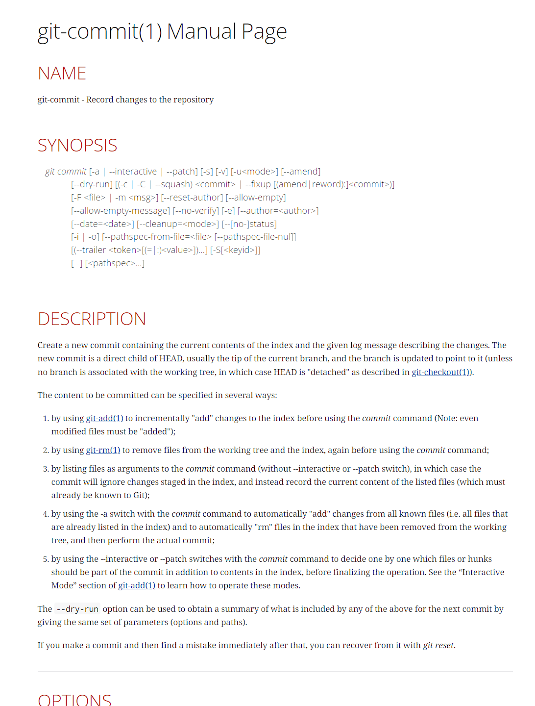

# Работа с Git
## 1. Проверка ниличия установленного Git
В терминале выполнить команду 
```
git --version
```
Если Git установлен появится информация о версии программы, иначе будет сообщение об ошибке.

## 2. Установка Git
Загружаем последнюю версию программы с [сайта](https://git-scm.com/downloads)
Устанавливаем с настройками по умолчанию.


## 3.Настройка
Задаем имя пользователя git
```
git config --global user.name "<ваше_имя>"
```
Теперь установим email пользователя. 
```
git config --global user.email "<адрес_почты@email.com>"
```
## 4. Инициализация репозитория
Инициализация локального репозитория
```
git init
```

## 5. Запись измеенний в репозиторий
Получение информации от git о его текущем состоянии
```
git status
```
Добавление файлов к следующему коммиту
```
git add <имя_файла> 
git add <имя_файла1> <имя_файла2> <имя_файлаN>
```
Добавление всех файлов в папке к коммиту
```
git add --all
git add .
```
Увидеть разницу между текущим файлом и закоммиченным файлом
```
git diff
```
Создание коммита 
```
git commit -m "комментарий"
```
Автодобавление изменений и автокоммит 
```
git commit -am "комментарий"
```

## 6. Просмотр истории коммитов
Вывод на экран истории всех коммитов с их хеш-кодами
```
git log 
```

## 7. Перемещение между сохранениями (коммитами)
Переход переход от одного коммита к другому
```
git checkout 
```
Переход к актуальному сосотоянию - ветка master
```
git checkout master
```
Вывести список веток
```
git branch 
```
Создать новую ветку
```
git branch <название_ветки>
```
Удалить ненужную ветку
```
git branch -d <название_ветки>
```

git checkout -b <название_ветки>

git checkout <название_ветки>

## 8. Справка по работе с git

Вызов справки по git
```
git help
```
Вызов детальной справки по командам
```
git <команда> --help
```
Пример вывода команды *git commit --help*


Для консольного вывода
```
git add -h
```
## 8. Игнорирование файлов 


## На будущее

git clone
git merge
git remote
git fetch
git push
git pull

